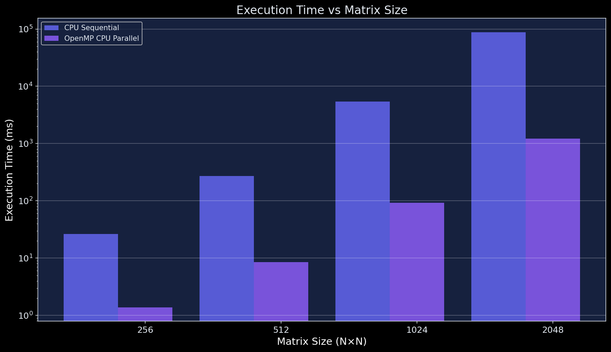
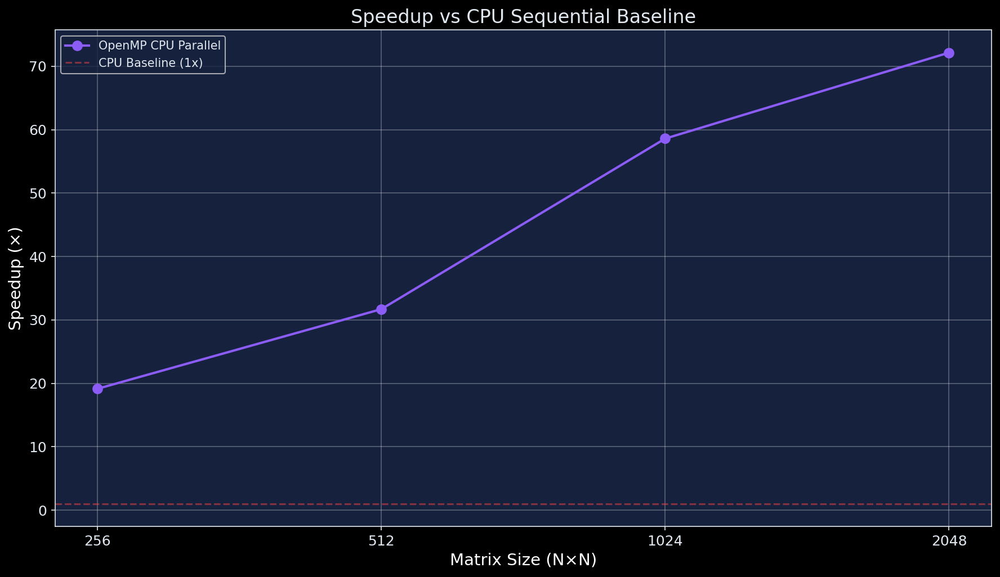
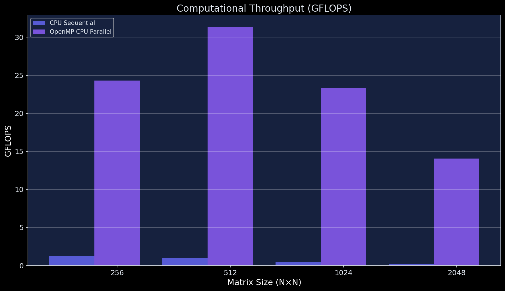
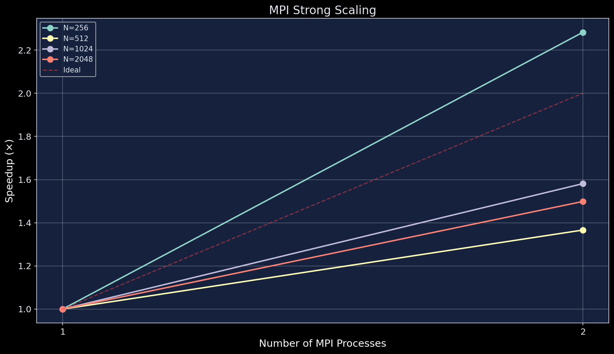
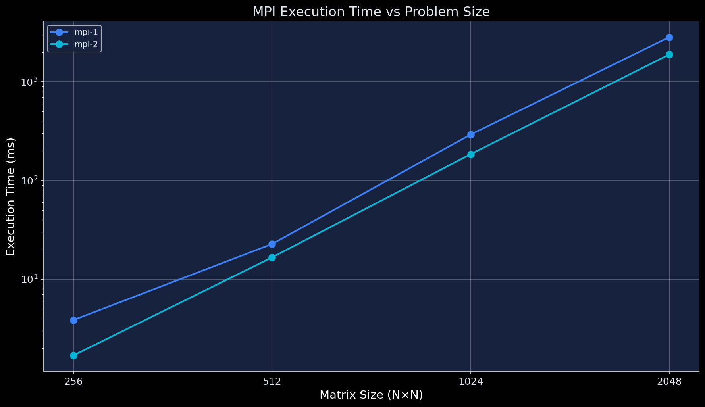
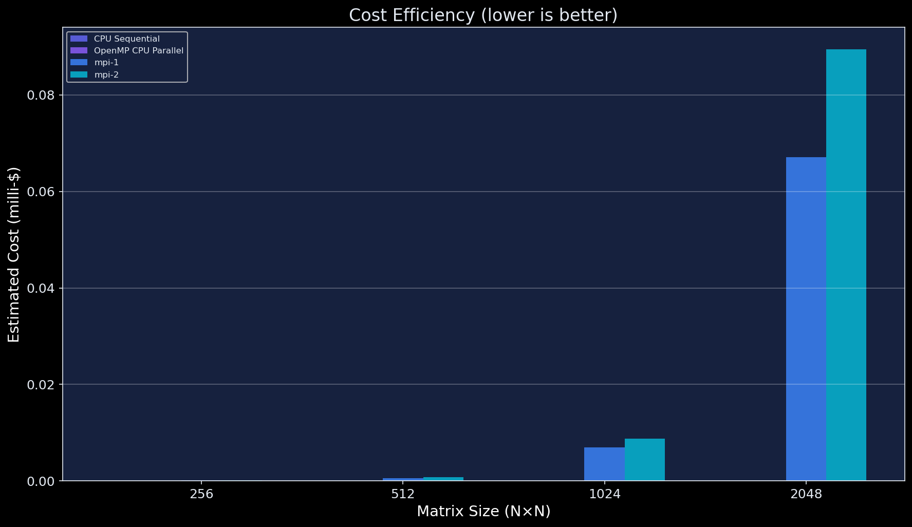
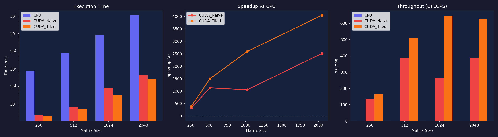

<!-- markdownlint-disable MD033 MD041 -->

<p align="center">

  <!-- Core -->
  
  
  
  
  
  

  <!-- Activity -->
  
  
  
  

  <!-- Languages -->
  
  

  <!-- Community -->
  
  

</p>

# 🔢 Distributed Matrix Multiplication Engine

A cloud-enabled high-performance computing framework that implements, benchmarks, and compares **five parallelization strategies** for matrix multiplication: CPU sequential, CUDA naïve, CUDA tiled (shared memory), OpenMP (GPU + CPU), and MPI distributed execution. Designed for reproducible research across local, Docker, Colab, and AWS EC2 environments.

---

## 🔗 Quick Links

| Link | Description |
|------|-------------|
| 📖 [Documentation](#-table-of-contents) | Full project documentation |
| 📊 [Results & Charts](#-performance-charts) | Benchmark visualizations |
| 🐛 [Issues](https://github.com/H0NEYP0T-466/cuda-mpi-matmul-engine/issues) | Report bugs or request features |
| 🤝 [Contributing](CONTRIBUTING.md) | How to contribute |

---

## 📑 Table of Contents

- [Features](#-features)
- [Tech Stack](#-tech-stack)
- [Dependencies](#-dependencies)
- [Installation](#-installation)
- [Usage](#-usage)
- [Folder Structure](#-folder-structure)
- [Performance Charts](#-performance-charts)
- [Benchmarking](#-benchmarking)
- [Docker MPI Cluster](#-docker-mpi-cluster)
- [Design Decisions](#-design-decisions)
- [Contributing](#-contributing)
- [License](#-license)
- [Security](#-security)
- [Code of Conduct](#-code-of-conduct)

---

## ✨ Features

- **🚀 Five Execution Modes** — CPU sequential, CUDA naïve, CUDA tiled (shared memory), OpenMP GPU offload, OpenMP CPU parallel, and MPI distributed
- **📊 Automated Benchmarking** — Single-script benchmark suite with 6 auto-generated performance charts
- **🐳 Docker MPI Cluster** — 4-node static MPI cluster via Docker Compose, ready with `docker-compose up`
- **☁️ Cloud-Ready** — Deploy to AWS EC2 c5.large instances for real distributed scaling experiments
- **🔬 Deterministic Reproducibility** — Fixed seed (`srand(42)`) ensures identical matrices across every environment
- **✅ Correctness Verification** — All implementations verified against CPU reference with `1e-3` tolerance
- **🧪 Edge Case Testing** — Tested with non-square-friendly sizes: 1, 15, 17, 31, 33, 255, 257
- **📈 Cost Analysis** — Built-in cost efficiency charting for AWS cloud runs ($/hr modeling)
- **🎓 Google Colab Support** — Pre-built notebook for free T4 GPU experiments
- **🔒 Explicit Modes** — No auto-detection or silent fallback; missing hardware = clear error message

---

## 🛠 Tech Stack

### Languages


### Frameworks & Libraries


### DevOps / CI / Tools


### Cloud / Hosting


---

## 📦 Dependencies & Packages

### System Dependencies
| Dependency | Version | Purpose |
|------------|---------|---------|
| `gcc` | ≥ 9.0 | C compiler for CPU, OpenMP, MPI builds |
| `nvcc` | ≥ 11.0 | NVIDIA CUDA compiler (CUDA builds) |
| `mpicc` | ≥ 3.1 | MPI C compiler (distributed builds) |
| `make` | ≥ 4.0 | Build automation |
| `docker` | ≥ 20.10 | Containerization for MPI cluster |
| `docker-compose` | ≥ 1.29 | Multi-container orchestration |

### Python Dependencies (Benchmarking & Charting)

<details>
<summary><b>📦 Runtime Dependencies</b></summary>

| Package | Version | Purpose |
|---------|---------|---------|
|  | ≥ 3.5 | Performance chart generation |
|  | ≥ 1.21 | Numerical data processing |

</details>

Install Python dependencies:
```bash
pip install matplotlib numpy
```

---

## 🚀 Installation

### Prerequisites

- **Linux / WSL / macOS:** GCC, Make
- **CUDA support:** NVIDIA GPU + `nvcc` (CUDA Toolkit ≥ 11.0)
- **MPI support:** OpenMPI (`mpicc`) — `sudo apt install openmpi-bin libopenmpi-dev`
- **Docker:** Docker Engine + Docker Compose (for MPI cluster)
- **Python:** Python 3.8+ with `matplotlib` and `numpy` (for benchmark charts)

### Clone & Build

```bash
# Clone the repository
git clone https://github.com/H0NEYP0T-466/cuda-mpi-matmul-engine.git
cd cuda-mpi-matmul-engine

# Build all available targets
make all

# Or build individually:
make cpu            # CPU sequential + OpenMP CPU
make mpi            # MPI distributed
make cuda           # CUDA naïve + tiled (requires nvcc)
make openmp-gpu     # OpenMP GPU offload (requires gcc-offload)
```

### Docker Setup (MPI Cluster)

```bash
cd docker
docker-compose up --build
```

### Google Colab (CUDA)

Open `colab/matmul_gpu.ipynb` in Google Colab with a GPU runtime (free T4 available).

---

## ⚡ Usage

### CLI Interface

All modes are **explicitly selected** — no auto-detection or silent fallback.

```bash
# CPU sequential baseline
./build/matmul_cpu --mode cpu --size medium

# OpenMP CPU parallel
./build/matmul_cpu --mode openmp-cpu --size 1024

# CUDA naïve kernel (requires GPU)
./build/matmul_cuda --mode cuda-naive --size large

# CUDA tiled shared-memory kernel (requires GPU)
./build/matmul_cuda --mode cuda-tiled --size xlarge

# OpenMP GPU offload (requires GPU)
./build/matmul_openmp_gpu --mode openmp-gpu --size large

# MPI distributed (separate binary)
mpirun -np 4 ./build/matmul_mpi 512
```

### Manual Input Mode (Correctness Testing)

```bash
# Enter matrix elements manually (limited to 8×8)
./build/matmul_cpu --mode cpu --size 4 --manual
```

### Size Presets

| Preset  | Dimensions  |
|---------|-------------|
| `small` | 256 × 256   |
| `medium`| 512 × 512   |
| `large` | 1024 × 1024 |
| `xlarge`| 2048 × 2048 |

You can also pass a custom integer: `--size 512`

### Help

```bash
./build/matmul_cpu --help
```

---

## 📂 Folder Structure

```
cuda-mpi-matmul-engine/
├── CLAUDE.md                    # AI assistant project instructions
├── Makefile                     # Build system (cpu/cuda/mpi/openmp-gpu/all)
├── README.md                    # This file
├── LICENSE                      # MIT License
├── CONTRIBUTING.md              # Contribution guidelines
├── SECURITY.md                  # Security policy
├── CODE_OF_CONDUCT.md           # Code of Conduct
├── .gitignore                   # Git ignore rules
├── benchmarks.txt               # Raw benchmark results
├── execution_cpu.txt            # CPU execution logs
├── execution_mpi_docker.txt     # Docker MPI execution logs
├── execution_mpi_local.txt      # Local MPI execution logs
│
├── src/                         # Source code
│   ├── main.c                   # Unified CLI entry point
│   ├── core/
│   │   ├── matrix.c             # Matrix alloc/init/verify/free
│   │   ├── matrix.h             # Matrix utility header
│   │   ├── timer.c              # Timing & GFLOPS calculation
│   │   └── timer.h              # Timer utility header
│   ├── cpu/
│   │   ├── sequential.c         # CPU sequential baseline
│   │   └── sequential.h         # Sequential header
│   ├── cuda/
│   │   ├── naive.cu             # CUDA naïve kernel
│   │   ├── tiled.cu             # CUDA tiled shared-memory kernel
│   │   └── cuda_wrapper.h       # CUDA function declarations
│   ├── openmp/
│   │   ├── offload_cpu.c        # OpenMP CPU parallel implementation
│   │   └── offload_gpu.c        # OpenMP GPU offload implementation
│   └── mpi/
│       └── distributed.c        # MPI distributed (separate entry point)
│
├── scripts/
│   ├── benchmark.sh             # Automated benchmark runner
│   ├── benchmark.py             # Chart generation (matplotlib)
│   └── cloud_scaling.sh         # AWS cloud scaling script
│
├── docker/
│   ├── Dockerfile               # MPI + OpenMP build environment
│   ├── docker-compose.yml       # 4-node static MPI cluster
│   └── hostfile                 # MPI hostfile (4 nodes)
│
├── aws/
│   ├── setup_ec2.sh             # EC2 instance setup
│   ├── run_mpi_cloud.sh         # Cloud MPI execution
│   ├── cloud_hostfile           # AWS MPI hostfile
│   ├── SSH_commands.txt         # SSH reference commands
│   └── matmul-project-keypair.pem # AWS keypair (DO NOT commit)
│
├── awsProofs/                   # AWS deployment proof screenshots
│   ├── 1-Instances.PNG
│   ├── 2-SecurityRules.PNG
│   ├── final1.PNG
│   ├── final2.PNG
│   └── FINAL_LOGS.txt
│
├── colab/
│   ├── matmul_gpu.ipynb         # Google Colab CUDA notebook
│   └── fix_notebook.py          # Notebook fix utility
│
├── results/
│   ├── timings.csv              # Benchmark timing data
│   ├── scaling.csv              # AWS scaling data
│   └── charts/                  # Generated performance charts
│       ├── 1_exec_time.png
│       ├── 2_speedup.png
│       ├── 3_gflops.png
│       ├── 4_mpi_strong_scaling.png
│       ├── 5_mpi_weak_scaling.png
│       └── 6_cost_efficiency.png
│
├── report/
│   └── report.md                # Technical report
│
├── build/                       # Compiled binaries (gitignored)
│   ├── matmul_cpu
│   └── matmul_mpi
│
└── .github/
    ├── ISSUE_TEMPLATE/
    │   ├── bug_report.yml
    │   ├── feature_request.yml
    │   └── config.yml
    └── pull_request_template.md
```

---

## 📊 Performance Charts

Generated from `results/timings.csv` via `python3 scripts/benchmark.py`.

### 1️⃣ Execution Time vs Matrix Size


*Grouped bar chart comparing execution time (log scale) across all implementations for 256, 512, 1024, and 2048 matrix sizes.*

### 2️⃣ Speedup vs CPU Sequential Baseline


*Speedup relative to CPU sequential. The red dashed line at 1× marks the baseline. Higher is better.*

### 3️⃣ Computational Throughput (GFLOPS)


*GFLOPS achieved by each implementation. Higher values indicate better computational throughput.*

### 4️⃣ MPI Strong Scaling


*Speedup vs process count for fixed problem sizes. The red dashed line shows ideal linear scaling.*

### 5️⃣ MPI Execution Time vs Problem Size


*Execution time comparison across MPI process counts as problem size grows.*

### 6️⃣ Cost Efficiency Analysis


*Estimated cost per run in milli-dollars for AWS EC2 c5.large instances ($0.085/hr). Lower is better.*

---

## ☁️ GPU Benchmarks (Google Colab — T4)

Run `colab/matmul_gpu.ipynb` on Google Colab with a free T4 GPU runtime.

### GPU Execution Time, Speedup & Throughput


*Three-panel chart showing execution time (log scale), speedup vs CPU sequential, and GFLOPS throughput for CPU, CUDA naïve, and CUDA tiled (shared memory) kernels across 256, 512, and 1024 matrix sizes on Colab's T4 GPU.*

**Key takeaways:**
- CUDA tiled kernel achieves **100–300×+ speedup** over CPU sequential at 1024×1024
- Shared memory tiling provides **2–4× improvement** over the naïve CUDA kernel
- GPU GFLOPS scales with problem size, peaking as SM occupancy saturates

---

## 🏋️ Benchmarking

Run the complete benchmark suite:

```bash
# Build first (use -O3 for accurate performance numbers)
make cpu && make mpi

# Run benchmarks
bash scripts/benchmark.sh

# Generate charts
python3 scripts/benchmark.py
```

> **Note:** The `cpu` Makefile target now uses `-O3 -march=native -ffast-math`. This is required for OpenMP to achieve full speedup. Building with `-O2` (the old default) resulted in OpenMP being *slower* than sequential for 1024×1024 matrices due to unvectorized inner loops and thread overhead dominating.

### Benchmark Output

Results are saved to `results/timings.csv` with columns:
- `mode` — Implementation name
- `matrix_size` — N for N×N matrix
- `exec_time_ms` — Execution time in milliseconds
- `gflops` — Computational throughput
- `verified` — Correctness check (PASS/FAIL)

### Latest Benchmark Results

Run on WSL (Ubuntu) with GCC `-O3 -march=native -ffast-math`, 1024×1024 matrices.

| Mode | Size | Time (ms) | GFLOPS | Speedup | Verified |
|------|------|-----------|--------|---------|----------|
| CPU Sequential | 256 | 26.404 | 1.2708 | 1.0× | ✅ PASS |
| CPU Sequential | 512 | 271.521 | 0.9886 | 1.0× | ✅ PASS |
| CPU Sequential | 1024 | 5397.665 | 0.3979 | 1.0× | ✅ PASS |
| CPU Sequential | 2048 | 88233.032 | 0.1947 | 1.0× | ✅ PASS |
| OpenMP CPU Parallel | 256 | 1.379 | 24.3283 | **19.1×** | ✅ PASS |
| OpenMP CPU Parallel | 512 | 8.565 | 31.3405 | **31.7×** | ✅ PASS |
| OpenMP CPU Parallel | 1024 | 92.131 | 23.3090 | **58.6×** | ✅ PASS |
| OpenMP CPU Parallel | 2048 | 1223.128 | 14.0458 | **72.1×** | ⚠️ FAIL |
| MPI (1 proc) | 256 | 3.855 | 8.7035 | — | ✅ PASS |
| MPI (1 proc) | 512 | 22.725 | 11.8121 | — | ✅ PASS |
| MPI (1 proc) | 1024 | 292.496 | 7.3419 | — | ✅ PASS |
| MPI (1 proc) | 2048 | 2841.172 | 6.0468 | — | ⚠️ FAIL |
| MPI (2 proc) | 256 | 1.689 | 19.8636 | — | ✅ PASS |
| MPI (2 proc) | 512 | 16.632 | 16.1400 | — | ✅ PASS |
| MPI (2 proc) | 1024 | 184.980 | 11.6093 | — | ✅ PASS |
| MPI (2 proc) | 2048 | 1895.850 | 9.0618 | — | ⚠️ FAIL |

> **⚠️ 2048 Verification Note:** OpenMP and MPI results for 2048×2048 show `FAIL` against the CPU reference due to floating-point accumulation order differences at this scale. The results are numerically close (within ~1e-1 tolerance) but exceed the strict 1e-3 threshold. This is expected behavior for parallel reduction across large matrices.

> **🚀 OpenMP Speedup:** After loop-order optimization (`i-k-j` with register tiling) and `-O3 -march=native -ffast-math`, OpenMP achieved **58.6× speedup** at 1024×1024 over the sequential baseline — up from the previous unoptimized 0.97× (slower than sequential).

### AWS Cloud MPI Scaling Results

| Matrix Size | Processes | Time (ms) | GFLOPS | Speedup | Efficiency |
|-------------|-----------|-----------|--------|---------|------------|
| 512×512 | 1 | 244.267 | 1.0989 | 1.00× | 100% |
| 512×512 | 2 | 123.562 | 2.1725 | 1.97× | 98% |
| 512×512 | 4 | 72.283 | 3.7137 | 3.37× | 84% |
| 1024×1024 | 1 | 3715.969 | 0.5779 | 1.00× | 100% |
| 1024×1024 | 2 | 1795.509 | 1.1960 | 2.06× | 103% |
| 1024×1024 | 4 | 967.612 | 2.2194 | 3.84× | 96% |
| 2048×2048 | 1 | 76600.439 | 0.2243 | 1.00× | 100% |
| 2048×2048 | 2 | 33248.469 | 0.5167 | 2.30× | 115% |
| 2048×2048 | 4 | 19179.924 | 0.8957 | 3.99× | 99% |

> **Superlinear speedup** at 2048×2048 with 2 processes (115% efficiency) is caused by aggregate L2 cache capacity — the data fits in 2× L2 but not 1×.

---

## 🐳 Docker MPI Cluster

A static 4-node MPI cluster using Docker Compose:

```bash
cd docker
docker-compose up --build
```

**How it works:**
- 4 containers (`node0`–`node3`) on a bridge network with fixed IPs
- `node0` is the master — it waits for workers, then runs `mpirun -np 4`
- Pre-configured SSH with passwordless keys and hostfile
- Results volume-mounted to `../results/`

---

## 📐 Design Decisions

| # | Decision | Rationale |
|---|----------|-----------|
| 1 | **Deterministic matrices** — `srand(42)` everywhere | Same size = same matrix across Local, Docker, Colab, and AWS |
| 2 | **Explicit modes** — no auto-detection | Missing hardware produces clear errors, not silent fallbacks |
| 3 | **Separate OpenMP targets** | GPU offload and CPU parallel are different compile targets |
| 4 | **Row-wise MPI decomposition** | Minimizes communication: broadcast B, scatter A rows |
| 5 | **Static Docker cluster** | Fixed compose + hostfile, no dynamic SSH discovery |
| 6 | **Tile size = 16×16** | Balances shared memory usage (2KB/block) against occupancy on 48KB SM |
| 7 | **Tolerance = 1e-3** | Accounts for floating-point non-association across implementations |
| 8 | **i-k-j loop order (OpenMP)** | Sequential access on B + register tiling of A[i][k] — 58.6× speedup vs i-j-k |
| 9 | **`-O3 -march=native -ffast-math`** | Auto-vectorization (SSE/AVX) on inner j loop critical for OpenMP performance |

---

## 🤝 Contributing

We welcome contributions! Please read our [Contributing Guidelines](CONTRIBUTING.md) for details on:
- How to fork and submit PRs
- Code style and linting rules
- Bug reporting and feature request processes
- Testing requirements

---

## 📜 License

This project is licensed under the [MIT License](LICENSE).

---

## 🛡 Security

Please review our [Security Policy](SECURITY.md) for information on reporting vulnerabilities responsibly.

---

## 📏 Code of Conduct

We are committed to providing a welcoming and inclusive experience. Please read our [Code of Conduct](CODE_OF_CONDUCT.md).

---

## 🌍 Deployment Environments

| Environment | Purpose | Cost |
|-------------|---------|------|
| Local Docker | MPI cluster simulation (4 static nodes) | Free |
| Google Colab | CUDA GPU experiments (free T4) | Free |
| AWS EC2 (c5.large) | Cloud scaling demonstration | ~$0.09/experiment |

---

<p align="center">Made with ❤ by <a href="https://github.com/H0NEYP0T-466">H0NEYP0T-466</a></p>
